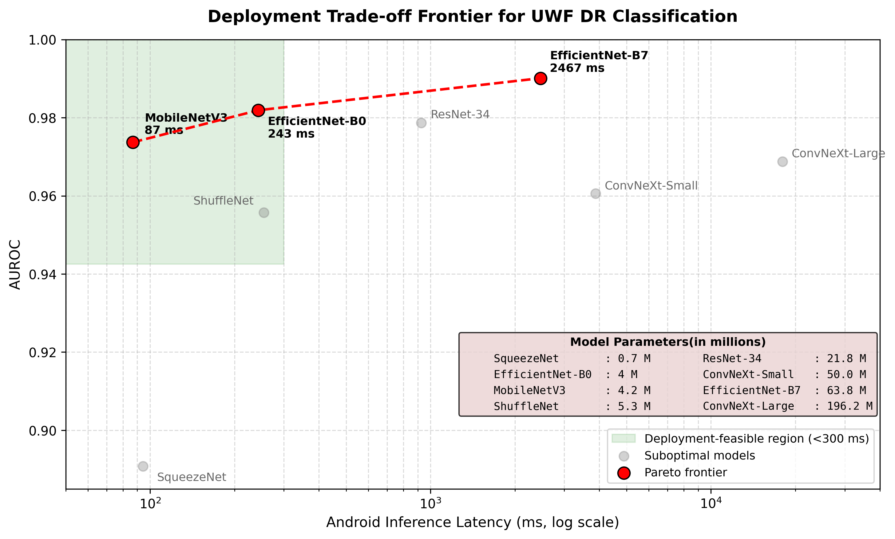

````markdown
## Deployment Trade-off Frontier



# Fundus Image Classification and Referable Diabetic Retinopathy Detection

This repository contains the implementation, experiments, and deployment pipeline for deep learning-based referable diabetic retinopathy (RDR) detection from retinal fundus images, including ultra-widefield (UWF) imaging experiments, federated learning, quantization, and mobile deployment analysis.

The project was developed as part of an MTech thesis focused on deployment-aware retinal disease screening using lightweight and high-performance convolutional neural networks.

---

# Features

- Binary classification for referable diabetic retinopathy (RDR)
- Support for regular fundus and ultra-widefield retinal images
- Multiple CNN architectures:
  - EfficientNet-B7
  - EfficientNet-B0
  - MobileNetV3-Large
  - ShuffleNet
  - ResNet-34
  - ConvNeXt
  - SqueezeNet
- Federated learning experiments using FedAvg
- Quantization-aware deployment analysis
- Android and desktop inference benchmarking
- TFLite model export for edge deployment
- AUROC, AUPRC, sensitivity, specificity, and threshold-based evaluation

---

# Repository Structure

```text
.
├── trainer.py
├── utils.py
├── tflite_models/
├── Model Weights/
├── regular_fundus_images/
├── ultra-widefield_images/
├── Zeiss Dataset/
├── fedLearning 1.ipynb
├── fedLearningClient2.ipynb
├── fedLearningClient3.ipynb
├── RDR_Zeiss.ipynb
├── Final_Thesis_Pritam.pdf
└── Thesis Pritam.pdf
````

---

# Project Components

## `trainer.py`

Contains the PyTorch training pipeline for binary classification models.

Features:

* Training and validation loops
* AUROC-based learning rate scheduling
* Early stopping support
* Mixed precision training support
* Validation metric tracking

---

## `utils.py`

Contains utility functions for:

* AUROC and AUPRC computation
* Threshold-based evaluation
* ROC and Precision-Recall plotting
* Bootstrap confidence intervals
* Training curve visualization
* Latency analysis

---

# Supported Architectures

The repository includes experiments with:

| Model             | Purpose                           |
| ----------------- | --------------------------------- |
| EfficientNet-B7   | High-performance benchmark        |
| EfficientNet-B0   | Accuracy-efficiency trade-off     |
| MobileNetV3-Large | Real-time mobile deployment       |
| ShuffleNet        | Lightweight inference             |
| ResNet-34         | Baseline CNN comparison           |
| ConvNeXt          | Modern high-capacity architecture |
| SqueezeNet        | Ultra-lightweight deployment      |

---

# Data Preprocessing and Augmentation

The preprocessing pipeline includes:

* Elliptical masking to remove non-retinal background
* CLAHE-based local contrast enhancement
* Random horizontal flipping
* Random rotation augmentation
* ImageNet normalization

---

# Federated Learning

Federated learning experiments were performed using:

* Federated Averaging (FedAvg)
* Multiple simulated clients
* Privacy-preserving decentralized training

Relevant notebooks:

* `fedLearning 1.ipynb`
* `fedLearningClient2.ipynb`
* `fedLearningClient3.ipynb`

---

# Quantization and Deployment

The repository includes:

* INT8 quantization experiments
* Android deployment benchmarking
* TensorFlow Lite export
* Edge-device inference analysis

TFLite models are available in:

```text
tflite_models/
```

---

# Installation

Install the required packages:

```bash
pip install torch torchvision pandas scikit-learn \
opencv-python pillow matplotlib tqdm
```

---

# Training

1. Prepare dataset directories and CSV annotations.
2. Create PyTorch `Dataset` and `DataLoader` objects.
3. Configure:

   * model
   * optimizer
   * scheduler
   * loss function
4. Train using:

```python
trainer(
    train_loader,
    val_loader,
    model,
    criterion,
    optimizer,
    scheduler
)
```

---

# Evaluation

Use:

```python
getMetricsAtThreshold()
```

for:

* AUROC
* AUPRC
* Sensitivity
* Specificity
* Confusion matrix
* ROC curve
* Precision-recall curve

---

# Deployment Analysis

The project includes:

* Android latency benchmarking
* MacBook inference benchmarking
* Pareto frontier analysis for deployment trade-offs
* Quantized vs FP32 comparison

---

# Thesis Documents

* `Final_Thesis_Pritam.pdf`
* `Thesis Pritam.pdf`

These documents contain:

* methodology
* experiments
* deployment analysis
* federated learning results
* discussion and conclusions

---

# Citation

If you use this repository in your research, please cite the corresponding thesis or future publication.

---

# Author

**Pritam Kumar**
MTech Artificial Intelligence
Indian Institute of Science (IISc), Bangalore

---

# License

This repository is intended for academic and research purposes.

```
```
